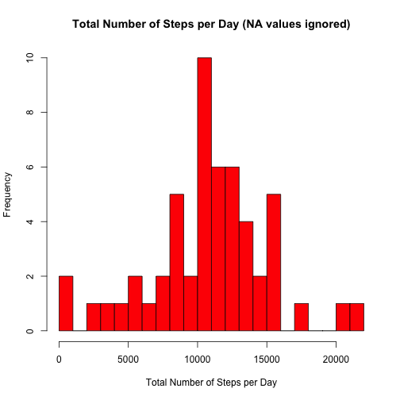
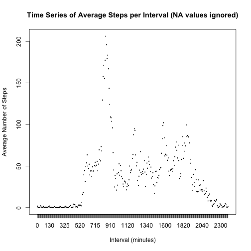
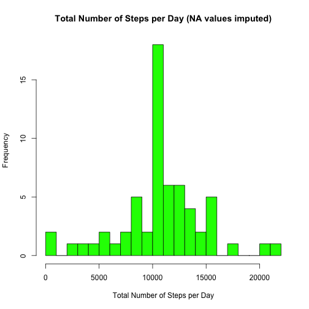

###Reproducible Research - Peer Assessment 1
####Kyle Statham - *July 2015*  

This assignment makes use of data from a personal activity monitory device. The data consists of two months of measurements from an anonymous individual collected during October and November, 2012 and includes the number of steps taken, measured at 5 minute intervals each day.

Summary information on total, mean and median steps per day, along with average daily activity pattern will be presented. The impact of imputing missing values and differences between weekday and weekend activity will also be examined.

The following code assumes the working directory in R has been set with the setwd() function and the required activity.csv file is present in that working directory. 

The dataset can be found here: [Activity monitoring data [52k]] (https://d396qusza40orc.cloudfront.net/repdata%2Fdata%2Factivity.zip)  

 
####1. Load the data from "activity.csv"" into data frame "activity"


```r
# Load "activity.csv" into data frame "activity"
activity <- read.csv("activity.csv", header = TRUE, sep = ",", na.strings = "NA")
# Check results
str(activity)
```

```
## 'data.frame':	17568 obs. of  3 variables:
##  $ steps   : int  NA NA NA NA NA NA NA NA NA NA ...
##  $ date    : Factor w/ 61 levels "2012-10-01","2012-10-02",..: 1 1 1 1 1 1 1 1 1 1 ...
##  $ interval: int  0 5 10 15 20 25 30 35 40 45 ...
```

```r
head(activity)
```

```
##   steps       date interval
## 1    NA 2012-10-01        0
## 2    NA 2012-10-01        5
## 3    NA 2012-10-01       10
## 4    NA 2012-10-01       15
## 5    NA 2012-10-01       20
## 6    NA 2012-10-01       25
```

  
####2. Process/transform the data as necessary into a format suitable for analysis


```r
# Transform date variable to date
activity$date <- as.Date(activity$date, format="%Y-%m-%d")
# Transform interval variable to factor
activity$interval <- as.factor(activity$interval)
# Create data frame activity_nona without NA's
activity_nona <- na.omit(activity)
# Set options
options(digits = 10, scipen = 3, tidy = FALSE)
# Check results
str(activity_nona)
```

```
## 'data.frame':	15264 obs. of  3 variables:
##  $ steps   : int  0 0 0 0 0 0 0 0 0 0 ...
##  $ date    : Date, format: "2012-10-02" "2012-10-02" ...
##  $ interval: Factor w/ 288 levels "0","5","10","15",..: 1 2 3 4 5 6 7 8 9 10 ...
##  - attr(*, "na.action")=Class 'omit'  Named int [1:2304] 1 2 3 4 5 6 7 8 9 10 ...
##   .. ..- attr(*, "names")= chr [1:2304] "1" "2" "3" "4" ...
```

```r
head(activity_nona)
```

```
##     steps       date interval
## 289     0 2012-10-02        0
## 290     0 2012-10-02        5
## 291     0 2012-10-02       10
## 292     0 2012-10-02       15
## 293     0 2012-10-02       20
## 294     0 2012-10-02       25
```

  
####3. Ignoring missing values, calculate the total number of steps taken per day, make a histogram of total number of steps taken per day and calculate the mean and median total number of steps taken per day


```r
# Calculate total steps per day
StepsPerDay <- aggregate(activity_nona$steps, list(date=activity_nona$date), sum, na.rm = TRUE)
colnames(StepsPerDay) <- c("date","total_steps")
# Check results
str(StepsPerDay)
```

```
## 'data.frame':	53 obs. of  2 variables:
##  $ date       : Date, format: "2012-10-02" "2012-10-03" ...
##  $ total_steps: int  126 11352 12116 13294 15420 11015 12811 9900 10304 17382 ...
```

```r
head(StepsPerDay)
```

```
##         date total_steps
## 1 2012-10-02         126
## 2 2012-10-03       11352
## 3 2012-10-04       12116
## 4 2012-10-05       13294
## 5 2012-10-06       15420
## 6 2012-10-07       11015
```

Create a histogram showing total number of steps per day


```r
#Create histogram
hist(StepsPerDay$total_steps, breaks = 25, col = "red",
     xlab = "Total Number of Steps per Day", 
     main = "Total Number of Steps per Day (NA values ignored)")
```

 

Calculate the mean and median number of steps per day


```r
# Calculate mean and median
StepsPerDayMean <- round(mean(StepsPerDay$total_steps, na.rm = TRUE),0)
StepsPerDayMedian <- (median(StepsPerDay$total_steps, na.rm = TRUE))
```

####==========================================================================
####>Ignoring NA values gives a mean of 10766 and a median of 10765.
####==========================================================================

####4. Make a time series plot of the 5-minute interval and the average number of steps taken, averaged across all days and identify which 5-minute interval contains the maximum number of steps


```r
# Calculate interval means
IntervalMeans <- aggregate(activity_nona$steps, list(date=activity_nona$interval), mean, na.rm = TRUE)
colnames(IntervalMeans) <- c("interval","mean")
# Check results
str(IntervalMeans)
```

```
## 'data.frame':	288 obs. of  2 variables:
##  $ interval: Factor w/ 288 levels "0","5","10","15",..: 1 2 3 4 5 6 7 8 9 10 ...
##  $ mean    : num  1.717 0.3396 0.1321 0.1509 0.0755 ...
```

```r
head(IntervalMeans) 
```

```
##   interval          mean
## 1        0 1.71698113208
## 2        5 0.33962264151
## 3       10 0.13207547170
## 4       15 0.15094339623
## 5       20 0.07547169811
## 6       25 2.09433962264
```

Create the time series plot


```r
plot(IntervalMeans$interval, IntervalMeans$mean, type="l", col = "blue", 
     xlab="Interval (minutes)", ylab="Average Number of Steps",
     main="Time Series of Average Steps per Interval (NA values ignored)")
```

 

Which 5-minute interval, on average across all the days in the dataset, contains the maximum number of steps?


```r
#Find the highest mean
MaxMean <- which(IntervalMeans$mean == max(IntervalMeans$mean))
#Show the interval associated with the highest mean
MaxInterval <- IntervalMeans[MaxMean, 1]
```

####==========================================================================
####>The 5-minute interval, on average across all the days in the dataset, that contains the maximum number of steps is 835.
####==========================================================================

####5. Calculate and report the total number of missing values in the dataset, create a new dataset by replacing the missing values with corresponding interval means, then using this new dataset make a histogram of total steps taken each day and calculate the mean and median of total steps per day. Finally, report on differences between total/mean/median steps per day between what this new dataset shows and what was calculated for the dataset which ignored NA values.


```r
NAcount <- sum(!complete.cases(activity))
```

####==========================================================================
####>The total number of incomplete cases is 2304.
####==========================================================================

Create a new dataset "activity_imputed" where NA values for the step variable are replaced with the corresponding interval mean


```r
activity_imputed <- activity 
for (i in 1:nrow(activity_imputed)) {
    if (is.na(activity_imputed$steps[i])) {
        activity_imputed$steps[i] <- IntervalMeans[which(activity_imputed$interval[i] == IntervalMeans$interval), ]$mean
    }
}
```

Calculate the total steps per day using imputed values


```r
# Calculate total steps per day
StepsPerDayImputed <- aggregate(activity_imputed$steps, list(date=activity_imputed$date), sum, na.rm = TRUE)
colnames(StepsPerDayImputed) <- c("date","total_steps")
# Check results
str(StepsPerDayImputed)
```

```
## 'data.frame':	61 obs. of  2 variables:
##  $ date       : Date, format: "2012-10-01" "2012-10-02" ...
##  $ total_steps: num  10766 126 11352 12116 13294 ...
```

```r
head(StepsPerDayImputed)
```

```
##         date total_steps
## 1 2012-10-01 10766.18868
## 2 2012-10-02   126.00000
## 3 2012-10-03 11352.00000
## 4 2012-10-04 12116.00000
## 5 2012-10-05 13294.00000
## 6 2012-10-06 15420.00000
```

Create a histogram showing total number of steps per day using imputed values


```r
#Create histogram
hist(StepsPerDayImputed$total_steps, breaks = 25, col = "green", 
     xlab = "Total Number of Steps per Day", 
     main = "Total Number of Steps per Day (NA values imputed)")
```

 

Calculate the imputed mean and median number of steps per day


```r
# Calculate mean and median
StepsPerDayMeanImputed <- round(mean(StepsPerDayImputed$total_steps, na.rm = TRUE),0)
StepsPerDayMedianImputed <- round(median(StepsPerDayImputed$total_steps, na.rm = TRUE),0)
```

####==========================================================================
####>Replacing NA values with corresponding interval means gives a mean of 10766 and a median of 10766.  
####==========================================================================


####6. Using the dataset containing imputed values, create a new variable in the dataset to denote whether the activity reading occurred on a weekday or a weekend. Make a panel plot containing a time series plot of average steps per 5-minute interval, averaged across all weekday days or weekend days.


```r
activity_imputed$day <- factor(format(activity_imputed$date, "%A"))
levels(activity_imputed$day)
```

```
## [1] "Friday"    "Monday"    "Saturday"  "Sunday"    "Thursday"  "Tuesday"  
## [7] "Wednesday"
```

```r
levels(activity_imputed$day) <- list(weekday = c("Monday", "Tuesday", 
                                                 "Wednesday", "Thursday", 
                                                 "Friday"), 
                                     weekend = c("Saturday", "Sunday"))
levels((activity_imputed$day))
```

```
## [1] "weekday" "weekend"
```

Calculate new averages by weekday and weekend


```r
DayMeans <- aggregate(activity_imputed$steps, list(interval = as.numeric(as.character(activity_imputed$interval)), weekdays = activity_imputed$day), FUN = "mean")
names(DayMeans)[3] <- "DayStepMeans"
```

Create panel plot to compare weekend vs weekday activity


```r
library(lattice)
weekdayplot <- xyplot(DayMeans$DayStepMeans ~ DayMeans$interval | DayMeans$weekdays, layout = c(1, 2), type = "l", xlab = "Interval", ylab = "Number of steps")
print(weekdayplot)
```

 
